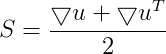
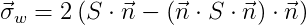
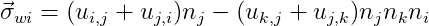
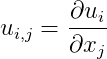

# Wall Shear Stress in 3D
On Wall Shear Rate and Wall Shear Stress computation on Unstructured Grids using VMTK

Here are some notes on the way wall shear stress calculated in VMTK package and also benchmark 3D velocity fields.

In simple words:

shear rate tensor: 

wall shear rate: 

or 

wall shear rate components: 

and

wall shear stress components: 

where

